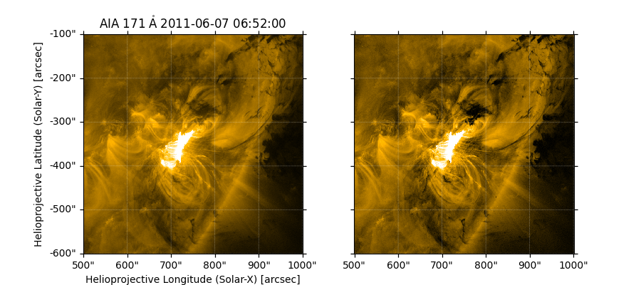
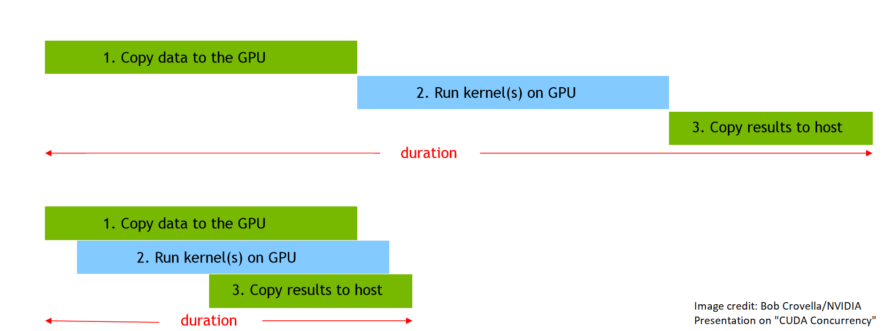

# Helio Hack Week 2020 Report: Team Accelerate AIApy
_team: Chris Bard (GSFC, lead), Raphael Attie (GMU/GSFC), Will Barnes (NRL), Luiz Guedes dos Santos (CUA/GSFC), Jack Ireland (GSFC), Peter Schuck (GSFC), Paul Wright (Stanford), Jinwoong Yoo (UMD/GSFC)_

_mentors: Matthew Nicely (NVIDIA), Zahra Ronaghi (NVIDIA)_

_2020/08/26-28_

## Results
* Had fun!
* Learned about CuPy/Numba GPU acceleration, GPU programming tips/methodology 
* New merge request to AIApy; add `normalize_exposure function` (*Paul Wright*)
* [Experimented with analyzing time-stacked cubes of AIA data with Dask/CuPy](./code/barnes) (*Will Barnes, Zahra Ronaghi*)
* [Faster version of `sunpy.map.maputils.contains_full_disk()`](https://github.com/wafels/sunpy/blob/faster_full_disk/sunpy/map/maputils.py#L149) (*Jack Ireland*)
* Worked on profiling/accelerating basic AIApy processing pipeline with GPUs/Dali (*Peter Schuck, Will Barnes, Matthew Nicely*)
    - [examples of loading FITS files with Dali](https://github.com/mnicely/dali_examples)
* Experimented with [Numba GPU-accelerated version](./code/Luiz/psf_numba_gpu.py) of `aiapy.psf._psf` (*Luiz Guedes dos Santos, Jinwoong Yoo, Matthew Nicely*)
* Experimented with GPU-accelerated version of `aiapy.psf.deconvolve` (*Matthew Nicely*)
* [Experimented with updating `aiapy.calibrate.register` with CuPy](./code/Bard/update_register.py) (*Chris Bard*)
* [Testing/timing different implementations](https://github.com/WaaallEEE/AIA_acceleration/blob/master/code/Bard/timeit_profiling.ipynb) ([other tests here](./code/Bard/)) of `aiapy.calibrate.register` using J.I.'s `contains_full_disk`, openCV, and CuPy (*Raphael Attie, Chris Bard*)


## Take aways
* Profiling is your best friend. 
* New version of `contains_full_disk` is much better for AIA data prep; this could be put into AIA (or else merged into sunpy)
* Sunpy has some overhead which could be streamlined or removed for AIA-specific cases (future: will raise an issue at the AIApy repo)
* Doing the reduction pipeline using GPUs promises to be the fastest for large datasets.
    - Caveat: we currently have OpenCV `register` function faster than CuPy `register`(both faster than current AIApy)
    - OpenCV has third order interpolation, CuPy version only supports 0th or 1st order
    - psf calculation faster with Numba
    - psf deconvolution with CuPy under construction, but looks like it will be faster (also see Mark Cheung's implementation of R-L deconvolution on GPUs with CUDA)
  - pipeline under construction: lvl1 -> GPU psf deconvolution -> CPU openCV register -> level 2(?)
---
_project introduction, additional project ideas below_

## Helio Hack Week Project Intro: Accelerate AIApy
_author: Chris Bard_

_2020/08/12_

---
This informal document serves as a brief(?) introduction to our hackweek project: **accelerating AIApy**. This document will identify some code bottlenecks and propose possible strategies for acceleration. There are two routines that we will mainly be working on: "aia_prep" and PSF deconvolution. 

**tl;dr: Possible paths to take**:
* AIA Prep (Level 1-> Level 1.5 data)
    - convert scipy.ndimage.affine_transform or skimage.transform.warp to dask-image equivalent
    - convert sunpy.map.contains_full_disk (?)
    - convert affine_transform or warp to GPU using CuPy?
    - use OpenCV python package (e.g. [based on Raphael Attie's utilization](https://github.com/WaaallEEE/AIA-reloaded/blob/master/calibration.py))
* PSF Deconvolution
    - test custom CuPy or Numba kernels against current CuPy implementation
    - develop pipeline of GPU asynchrononous memory transfer/deconvolution of multiple images concurrently
    - implement Dask version of deconvolution?
* General Pipelining for multiple images
    - PSF only
    - Prep only ("Level 1.5" data)
    - PSF + Prep ("Level 1.6" data)
        - CPU + GPU combination?
        - Fully GPU flow? CUDA, CuPy, Numba?
* Other ideas?
 
The highest priority is probably the AIA Prep flow, but all of the paths are a worthy use of our time. We have enough people on the team that we can tackle multiple objectives, if so desired.
 
*(The following sections borrow liberally from [the AIApy PSF Example](https://aiapy.readthedocs.io/en/latest/generated/gallery/skip_psf_deconvolution.html), the [AIApy prep example](https://aiapy.readthedocs.io/en/latest/generated/gallery/prepping_level_1_data.html), and the [AIApy source code](https://gitlab.com/LMSAL_HUB/aia_hub/aiapy); also see [Grigis et al. 2012](https://hesperia.gsfc.nasa.gov/ssw/sdo/aia/idl/psf/DOC/psfreport.pdf) for further PSF technical details. I thank Will Barnes for helpful discussions in understanding the basic challenges of accelerating AIApy, and Raphael Attie for further discussion on the prep pipeline.)*

## 1. AIA Prep (Level 1 -> 1.5)
### Code Dive
The `aia_prep` routine simply converts level 1 AIA data to level 1.5 AIA data. This basically means that the minimally processed (Level 0 -> Level 1) CCD data is stretched and translated to a standard format, including a common pointing, orientation, and plate scale for better comparison between different times. The minimal working example for this is:
```python
import astropy.units as u
from sunpy.net import Fido, attrs
import sunpy.map
from aiapy.calibrate import register, update_pointing

q = Fido.search(
    attrs.Time('2019-01-01T00:00:00', '2019-01-01T00:00:11'),
    attrs.Instrument('AIA'),
    attrs.Wavelength(wavemin=94*u.angstrom, wavemax=94*u.angstrom),
)
m = sunpy.map.Map(Fido.fetch(q))
m_updated_pointing = update_pointing(m) #2-3 seconds
m_registered = register(m_updated_pointing) #14-16 seconds
m_normalized = sunpy.map.Map(
    m_registered.data/m_registered.exposure_time.to(u.s).value,
    m_registered.meta
)
```
The prep routine is the `register()` function; on my laptop it takes about 14-16 seconds to complete. In the source code, the two longest routines in `register` are:
```python
# excerpted from aiapy/calibrate/prep.py; function register(), L55
if not contains_full_disk(smap): #this check took 12 seconds
        raise ValueError("Input must be a full disk image.")
```
and
```python
# excerpted from aiapy/calibrate/prep.py; function register(), L69
# takes 2 seconds (use_scipy = False) or 3 seconds (use_scipy = True)
tempmap = smap.rotate(recenter=True, scale=scale_factor.value,order=order,missing=missing,use_scipy=use_scipy)
```

### Acceleration
In talking with Will (also see [this pull request](https://github.com/sunpy/sunpy/issues/3266)), it turns out that `smap.rotate` does not play nice with Dask. For our purposes, the key underlying function is `sunpy.image.transform.affine_transform`, which uses either `skimage.transform.warp` or `scipy.ndimage.interpolation.affine_transform`. However, although Sunpy does allow `smap` to use Dask arrays, there are no Dask equivalents for either `warp` or `affine_transformation`. One of our goals is thus to implement one (or both) of these into the Dask library (see the [related pull request](https://github.com/dask/dask-image/issues/24)). I am not aware of any progress on this, so we would have to essentially write these functions from scratch, test them, and make a pull request to the `dask-image` git repo. Alternatively, we could check for (or implement) CuPy/Numba versions of these affine transformation routines.

Raphael Attie has implemented [a version of the prep package using OpenCV](https://github.com/WaaallEEE/AIA-reloaded/blob/master/calibration.py); he reports a speedup of about 10x on CPU. This may be another avenue to explore, and does look easier to incorporate into AIApy than Dask?

*WARNING: the rest of this subsection is speculative from a non-Sunpy programmer/physicist. Feedback on this discussion would be helpful.*

The other time sink is `sunpy.map.contains_full_disk`. I imagine that simply passing an option to disable this safety check would be a great speedup, but it does seem unsafe. Regardless, in profiling this function and following down all the way, it looks like most of the slowdown is in
```python
# excerpted from sunpy/map/maputils.py, function contains_full_disk(), L170
return np.all(coordinate_angles > solar_angular_radius(edge_of_world)) and ~is_all_off_disk(smap)
```
```python
#excerpted from sunpy/map/maputils.py, function is_all_off_disk(), L228
def is_all_off_disk(smap): 
    return np.all(~coordinate_is_on_solar_disk(all_coordinates_from_map(smap)))
```
It is ``all_coordinates_from_map()`` (which calls `all_pixel_indices_from_map()`; sunpy/map/maputils.py: L20) that is the bottleneck here. 

I imagine this process could be sped up specifically for AIA images? It looks like these functions are written for a general `smap`, so I am wondering if there are any shortcuts that we could take inherent to AIA data. Do we need to check every coordinate (`all_coordinates_from_map()`)? Are there ever any weird cases where an AIA image fails this check? Can we assume that the solar disk is "round" and exploit symmetry? Any progress on this particular check would greatly speed up the prep routine, unless I'm missing something important.

## 2. PSF Routines
AIA images are suspectible to blurring due to scattering and diffraction in the instrument optical components, as seen in this zoomed-in example (left image):



In order to remove this blurring, we calculate a Point Spread Function model that includes diffraction from the mesh grating of the filters, charge spreading, jitter, etc, and then apply the [Richardson-Lucy deconvolution algorithm](https://en.wikipedia.org/wiki/Richardson%E2%80%93Lucy_deconvolution). We can see the crisper result in the above right-side image.

### PSF Calculation Code Dive
The minimal working example that produces deconvolved data is:
```python
import astropy.units as u
from sunpy.net import Fido, attrs
import sunpy.map
import aiapy.psf

q = Fido.search(
    attrs.Time('2011-06-07T06:52:00', '2011-06-07T06:52:10'),
    attrs.Instrument('AIA'),
    attrs.Wavelength(wavemin=171*u.angstrom, wavemax=171*u.angstrom),
)
m = sunpy.map.Map(Fido.fetch(q))
psf = aiapy.psf.psf(m.wavelength)
m_deconvolved = aiapy.psf.deconvolve(m, psf=psf)
```
On my laptop, without a GPU, this program takes about 25-30 minutes to run. This is almost entirely due to the `aipy.psf.psf` routine; the deconvolution routine took about 1-2 minutes. Going deeper into the rabbit hole, we see that `aiapy.psf.psf` convolves two separate diffraction patterns (entrance filter and focal plane) into psfs:
```python
#excerpted from aiapy/psf/psf.py; function psf(...), L254
psf_entrance = _psf(meshinfo, angles_entrance, diffraction_orders) # takes 15-19 minutes (no GPU)
psf_focal_plane = _psf(meshinfo, angles_focal_plane, diffraction_orders,focal_plane=True) #takes 8-10 minutes (no GPU)
```
and later combines these into the final psf using `np.fft.fft2`. `_psf` is where the actual PSF calculation is performed:
```python
#excerpted from aiapy/psf/psf.py; function _psf(...), L296-
for order in diffraction_orders:
    if order == 0:
        continue
    intensity = np.sinc(order / mesh_ratio)**2  # I_0
    for dx, dy in zip(spacing_x.value, spacing_y.value):
        x_centered = x - (0.5*Nx + dx*order + 0.5)
        y_centered = y - (0.5*Ny + dy*order + 0.5)
        # NOTE: this step is the bottleneck and is VERY slow on a CPU
        psf += np.exp(-width_x*x_centered*x_centered
                      - width_y*y_centered*y_centered)*intensity
```
Note the source code's helpful comment directing us to the bottleneck. This `exp` function operates piecewise on two 4096x4096 arrays (`x_centered` and `y_centered`); this calculation takes a bit over one second on my laptop. There are 200 diffraction orders and 4 entrance angles (two focal plane angles) to loop over; this means that `psf_entrance` above takes about $1.2\times200\times4 = 960$ seconds, or 16 minutes. Similarly, `psf_focal_plane` does half as many loops and takes about 8 minutes. I imagine that if I had some kind of CPU multi-threading support, I could get this runtime lowered by some multiple. GPU acceleration is still better, however.

### PSF Acceleration
Will Barnes has already integrated CuPy into the `_psf` function by casting the `x`, `y`, and `psf` arrays in the above loop to CuPy/CUDA arrays via:
```python
#excerpted from aiapy/psf/psf.py, function _psf(), L278/286
if HAS_CUPY:
    psf = cupy.array(psf)
    x = cupy.array(x)
    y = cupy.array(y)
```
This allows the loop instructions, especially the `exp` calculation, to be done on the GPU. This leads to a large speedup in overall calculation time. Will reported that, for him, the PSF calculation took 5-6 minutes on a CPU (with possible numpy multi-threading) and 8 seconds on a GPU. I am not too familiar with how CuPy automatically converts the psf `for` loop into GPU instructions, so part of our mission will be to see if a custom [CuPy](https://docs.cupy.dev/en/stable/tutorial/kernel.html) or [Numba](https://numba.pydata.org/numba-doc/latest/cuda/kernels.html) GPU "kernel" (i.e. GPU function) could outperform this implementation. There is a lot of potential for parallelization in the psf loop, since each of the 4096^2 entries in the psf array are independent of one another. Also, each entry in the final result is technically a sum of 800 elements, so we can mess around with things like parallel reduction. For the integration into AIApy, I imagine something like
```python
if HAS_CUPY:
    _psf_gpu(...)
else:
    _psf_cpu()
```
inside of the main `psf()` routine would work (alternatively: HAS_NUMBA). I think this would be sufficient for most use cases.

### PSF Deconvolution
We could also mess around with accelerating the deconvolution algorithm (several FFT transforms), though it has also been integrated with CuPy in a similar manner to the psf loop above (arrays `psf/psf_conj` and `img_decon` below have been cast to the GPU). The key bottleneck here is
```python
#excerpted from aiapy/psf/deconvolve.py, function deconvolve(), L73
for _ in range(iterations):
    ratio = img/np.fft.irfft2(np.fft.rfft2(img_decon)*psf)
    img_decon = img_decon*np.fft.irfft2(np.fft.rfft2(ratio)*psf_conj)
```
which requires looping over some number of iterations of the L-R deconvolution algorithm. I'm not sure what the CuPy speed up is (compared to the 2 minutes on my laptop CPU). Again, I'm not sure how CuPy converts the loop instructions to the GPU execution, but I imagine any further speedup would require an implementation of the fft routines directly on the GPU (maybe via CUDA Rapids or CuPy or other L-R deconvolution libraries?).

Another small speedup might be to more tightly integrate the psf calculation + deconvolution combination. The current `psf()` function casts the final calculated psf array back to the CPU, and then the `deconvolve()` function takes this array and recasts it back to the GPU; we could eliminate this transfer, especially for devonvolution of multiple images with the same psf.

For Dask, it turns out that someone opened an [issue exploring implementing the deconvolution in Dask](https://github.com/dask/dask-image/issues/149); there is a linkthere to an interesting discussion on accelerating the FFT in Scipy. This could be another interesting avenue to explore.

## 3. Pipelining
### PSF Pipeline
We will need to slightly modify the individual image flow to create a pipeline for GPU PSF deconvolution of multiple images. To the best of my knowledge, the pipeline is **calculate psf for wavelength (first time only)**-->**get image**-->**apply deconvolution**-->**repeat from step 2**. Each wavelength image is \approx 35 MB, which is much less than the several GB onboard memory capacity of most GPUs. This means that in order to get full speedup, we need to be able to do the deconvolution on multiple images simultaneously (e.g. 6 GB / 35 MB is something like 171 images). This will require us to implement some form of concurrency (through streams and asnychronous memory transfers) so that the deconvolution on some images can take place while other images are being loaded/off-loaded on the GPU. 


We should be able to do this through CuPy/Numba.

### Combined PSF+Prep Pipeline
Another pipeline option is to combine both the PSF deconvolution and the aia_prep into a single pipeline. This converts the AIA level 1 images to so-called "level 1.6" images. It is important to note that the PSF convolution can only be done on level 1 images; to do both PSF and prep requires PSF first, and then prep.

I imagine this will require writing the full psf pipeline in CuPy/Numba, with adjustments made to keep needed arrays in GPU memory (e.g. the psf array for a given wavelength channel). The prep functions could also be written in CuPy and applied to the post-deconvolved data arrays on the GPU. However, based on the discussion above, most of the prep slow down appears to be in the native `smap` routines on the CPU. We may need to write a version of `smap` compatible with GPU acceleration in order to fully utilize the GPU in the pipeline. 